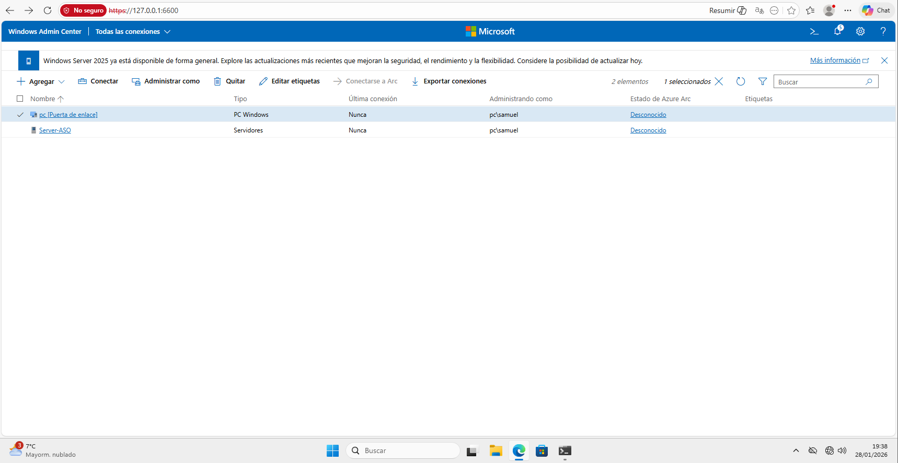
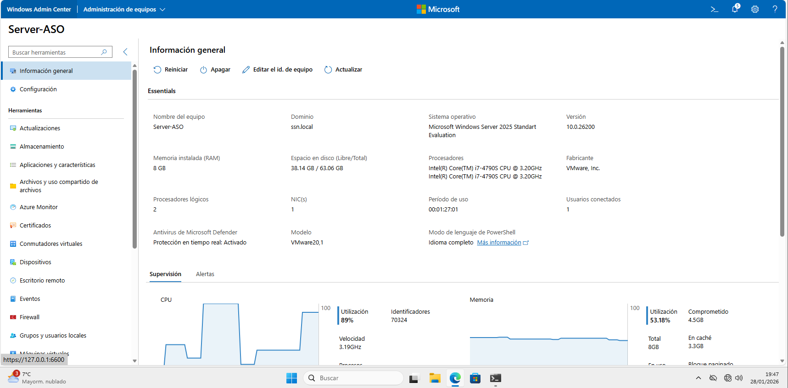
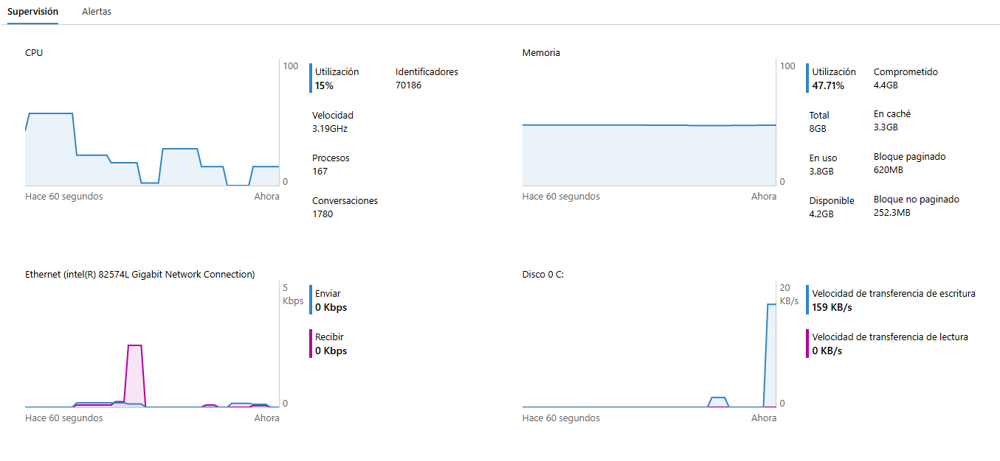
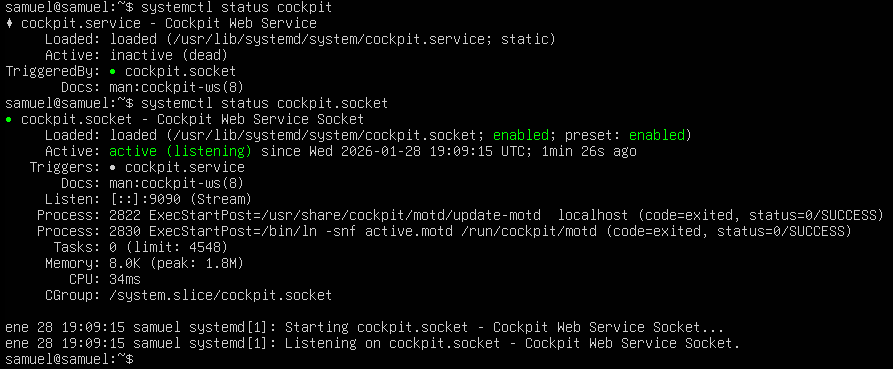
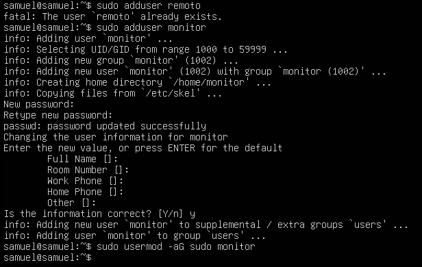
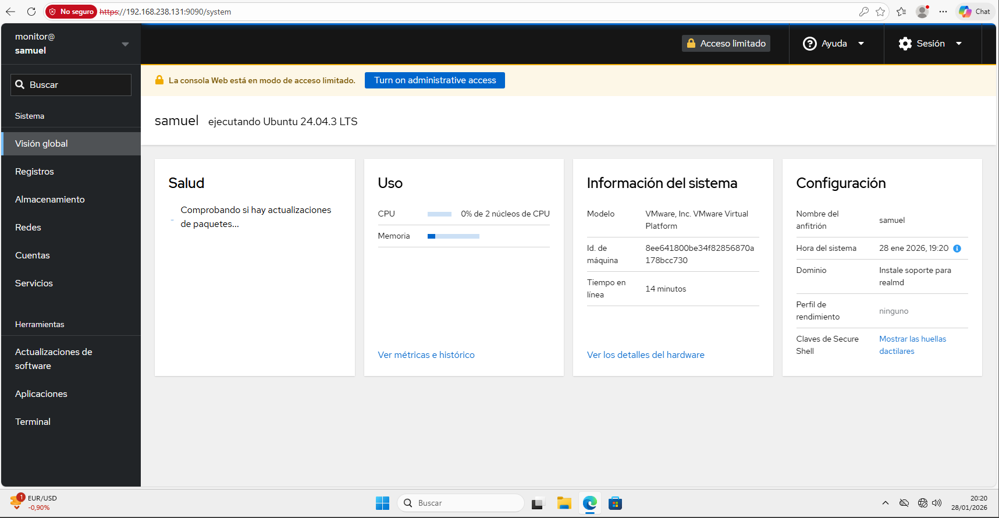
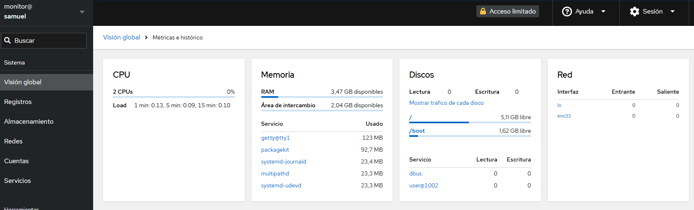

# UT4-Administración remota WAC y Cockpit

## 1. Acceso con WAC (Windows Admin Center)

### 1-Acceso a la interfaz del WAC
Para acceder al WAC tendremos que iniciar un navegador en el que buscaremos la IP localhost y el puerto correcpondiente del WAC, en este caso 6600.
Para añadir el servidor a monitorizar tendremos que añadirlo manualmente, indicando el nombre y posteriormente un usuario y contraseña con permiso de administrador.

### 2-Administración remota de WAC
Una vez con las credenciales podemos acceder al servidor de manera remota, aqui se ve información basica del server.

En este apartado podemos ver el consumo de recursos que está teniendo el servidor en tiempo real.

| Sistema administrado | Herramienta | Protocolo | Puerto |
|----------------------|-------------|-----------|--------|
|Windows Server 2025|Windows Admin Center|HTTPS WinRM SMB Kerberos|6600 (HTTPS) 5985/5986 (WinRM) 445 (SMB) 88 (Kerberos)|

## 2. Monitorización con Cockpit

### 1-Analisis del estado del servicio de cockpit
Para saber el estado en el que se encuentra el servicio de cockpit se usan los comandos `sudo systemctl status cockpit` y `sudo systemctl status cockpit.socket`.

### 2-Creacion de usuario de administración
Ahora para la monitorizacion tendremos que crear un usuario y lo metemos al grupo *sudo* para que tenga permisos de root usando el comando `sudo usermod -aG sudo remoto`.

### 3-Acceso a cockpit remotamente
Para acceder remotamente tendremos que entrar en un equipo distinto y en un navegador introducir la IP de la maquina de Ubuntu con el puerto 9090 que corresponde al de cockpit. Nos pedira usario y contraseña que usaremos los del usuario creado anteriormente.

### 4-Administración remota de cockpit
Una vez dentro podremos analizar distintos parametros que hay, por ejemplo en la pestaña de recursos podremos ver el consumo de recursos del Ubuntu.

| Sistema | Usuario remoto | Herramienta | Protocolo | Puerto |
|---------|----------------|-------------|-----------|--------|
| Ubuntu Server | Monitor | Cockpit | HTTPS | 9090 |
