# UT4 Practica2
## 1- Acceso remoto a través de Putty

## Acceso SSH
- Usuario autorizado: remoto
- Cliente: PuTTY  
- Autenticación: clave pública  
- Contraseña por SSH: deshabilitada  
- Usuarios no autorizados: acceso denegado  

### 1. Usuario creado
Para crear el usuario usaremos el comando `adduser (nombre)` y le añadimos al grupo sudo para darle permisos con `usermod -aG sudo (nombre)`.

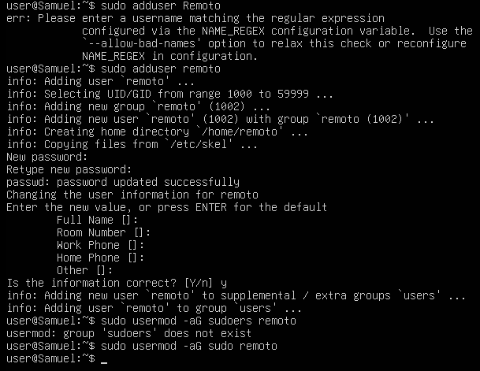
### 2. Servicio SSH activo
Para saber si el servicio está activo se usa `systemctl status ssh`, si no está activo se usa `systemctl start ssh`.

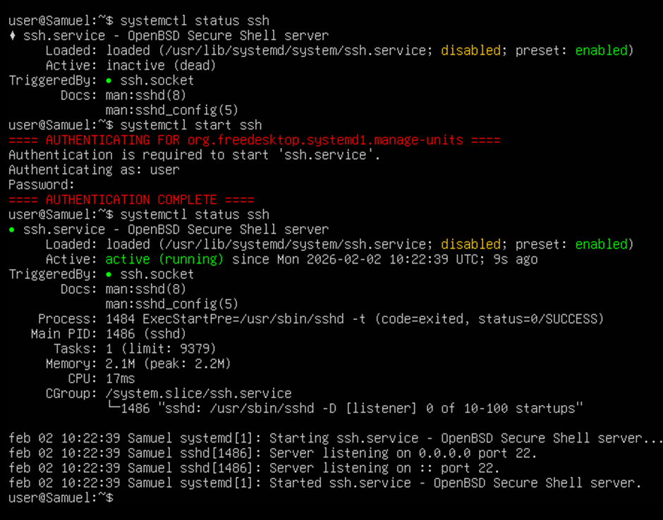
### 3. Claves generadas
Para cambiar los permisos de la clave publica usaremos el comando `chmod 400 (archivo)`.

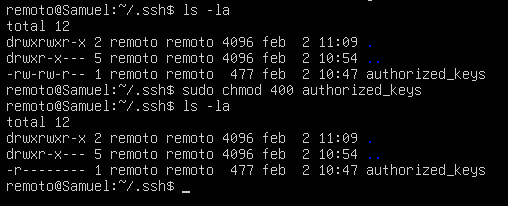
### 4. Acceso por contraseña deshabilitado
Para deshabilitar el acceso por contraseña tendremos que modificar el archivo que se encuentra en */etc/ssh/sshd_config*, ahí descomentamos el acceso por clave pública y ponemos no en `PasswordAuthentication`.

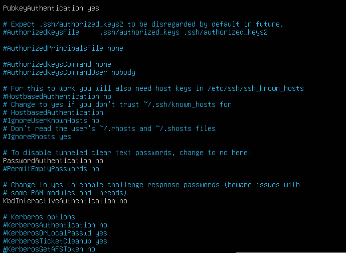
### 5. Acceso SSH desde PuTTY 
Primero tenemos que configurar las credenciales y la IP, indicando la clave privada y el usuario.

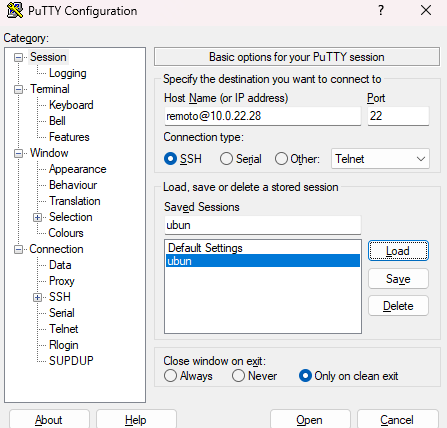
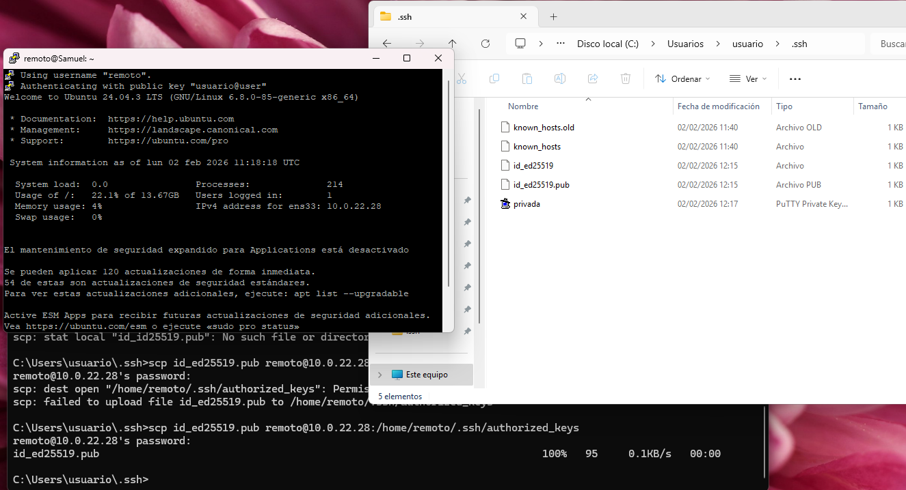
### 6. Acceso denegado a otro usuario
Al intentar iniciar con las credenciales de otro usuario con la misma clave nos da error.

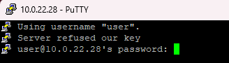

## 2- Acceso remoto a través de escritorio remoto

## Acceso RDP
- Usuario RDP: remoto_rdp
- Sistema administrado: Windows Server 2022  
- Protocolo: RDP  
- Grupo de acceso: Usuarios de Escritorio remoto  
- Cifrado: Sí  

### 1. Usuario remoto creado y añadido al grupo. 
Primero tendremos que crear un usuario nuevo y añadirlo al grupo de  `Usuarios de escritorio remoto`.

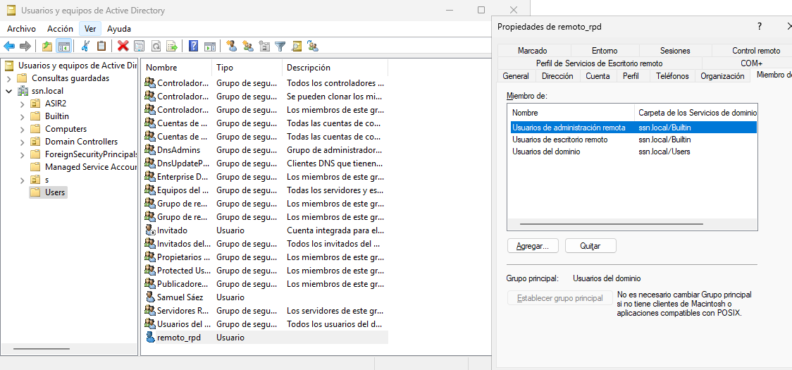
### 2. Autenticación de nivel de red 
Ahora se tiene que permitir el acceso remoto a usuarios de la misma red.

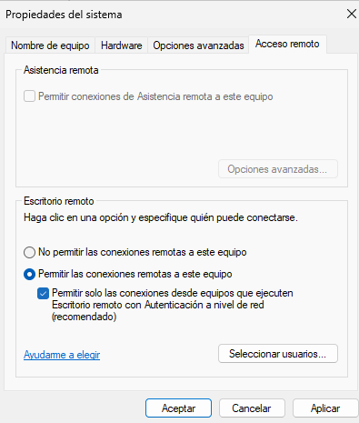
### 3. Acceso remoto con Escritorio Remoto
Para poder iniciar remotamente hay que añadir en la directiva de escritorio remoto el grupo se usuarios.

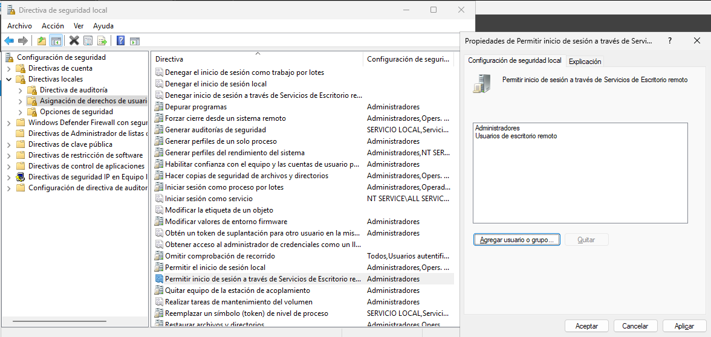

Una vez añadido el grupo a la directiva podremos iniciar sesión sin errores.

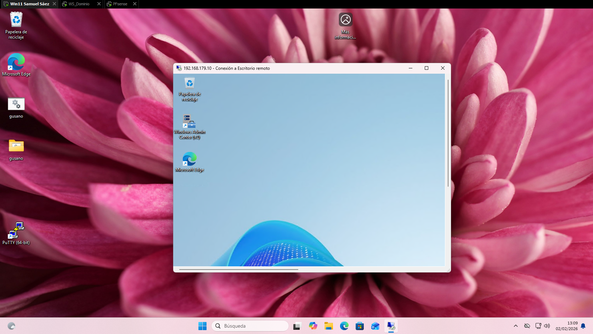
### 4. Acceso denegado a otro usuario
Si se intenta iniciar sesión con otro usuario fuera del grupo de usuarios, se les deniega el acceso.

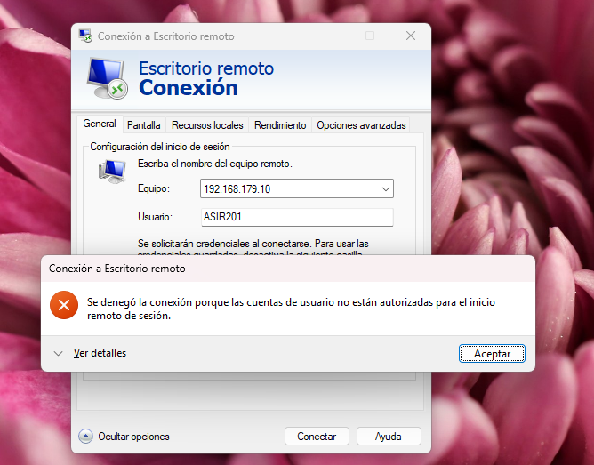

