# Parte 1: Mapeo Automático de Unidades de Red.

## 1. Configuración de Recursos Compartidos
El primer paso consistió en preparar la infraestructura de archivos en el servidor para que los diferentes departamentos puedan acceder a sus recursos.

### Estructura de Carpetas
Se ha creado una estructura jerárquica en la ruta local C:\Compartidas\. Las carpetas creadas son:

- Admin: Para el departamento de administración.
- Comun: Recurso compartido para todos los usuarios.
- Informatica: Para el departamento técnico.

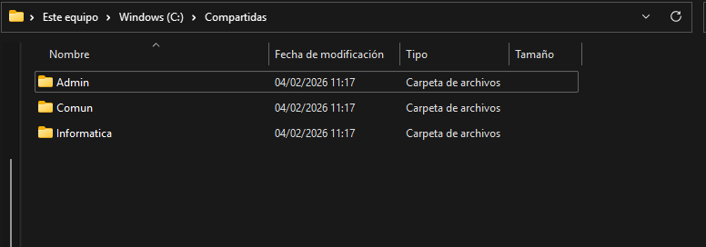

### Gestión de Permisos
Para garantizar la seguridad, se configuraron los permisos de recursos compartidos y permisos NTFS de la siguiente manera:

- Se eliminó el grupo "Todos" para restringir el acceso.
- Compartida-Admin: Solo permite el acceso al grupo GRP_Administracion.
- Compartida-Info: Solo permite el acceso al grupo GRP_Informatica.
- Compartida-Todos: Acceso permitido para todos los usuarios del dominio.
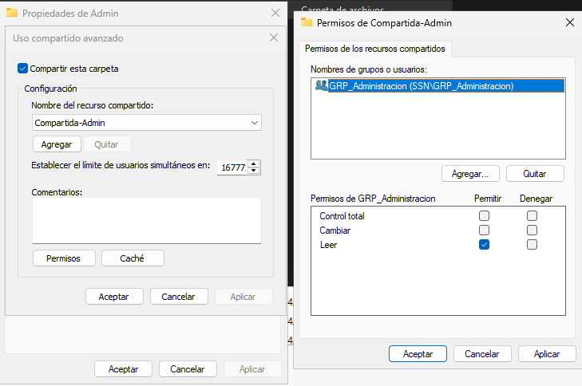

## 2. Configuración de la Política de Grupo (GPO)
Una vez preparados los recursos, se procedió a automatizar la conexión de estas carpetas mediante una GPO denominada Mapeo-Unidades-SSN.

### Vinculación de la GPO
La directiva se vinculó en la consola de Administración de directivas de grupo (GPMC) a las siguientes Unidades Organizativas (UO):

- UO_Administracion
- UO_Informatica 
- UO_Usuarios 
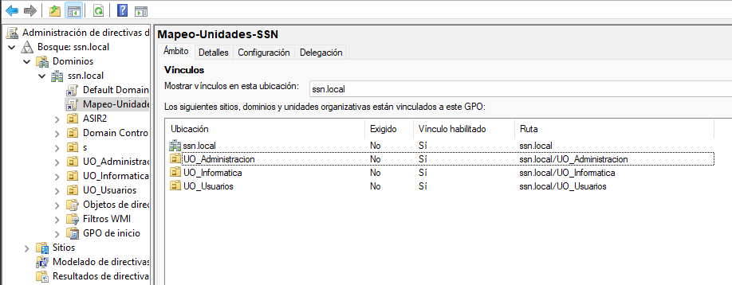

### Asignación de Unidades
Dentro de la GPO, en la ruta `Configuración de usuario > Preferencias > Configuración de Windows > Asignaciones de unidades`, se definieron las tres unidades de red:

- Unidad Z: Vinculada a \\WS-GUI-SSN-DC1\Compartida-Admin.
- Unidad Y: Vinculada a \\WS-GUI-SSN-DC1\Compartida-Info.
- Unidad X: Vinculada a \\WS-GUI-SSN-DC1\Compartida-Todos.
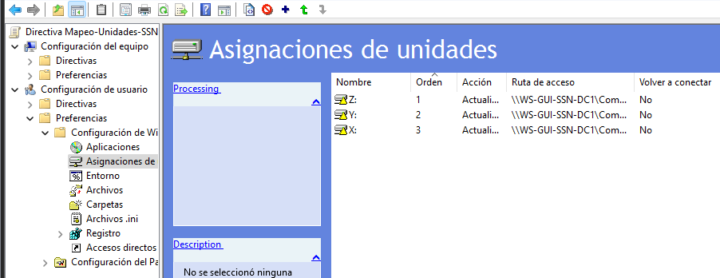

## 3. Segmentación a Nivel de Elemento
Para que los usuarios vean únicamente las unidades que les corresponden por departamento, se utilizó la Segmentación a nivel de elemento.

### Filtros por Grupo de Seguridad
Se configuró una condición en la pestaña "Común" de cada unidad:

- Unidad Z: Se aplica solo si el usuario es miembro del grupo de seguridad SSN\GRP_Administracion.
- Unidad Y: Se aplica solo si el usuario es miembro del grupo de seguridad SSN\GRP_Informatica.
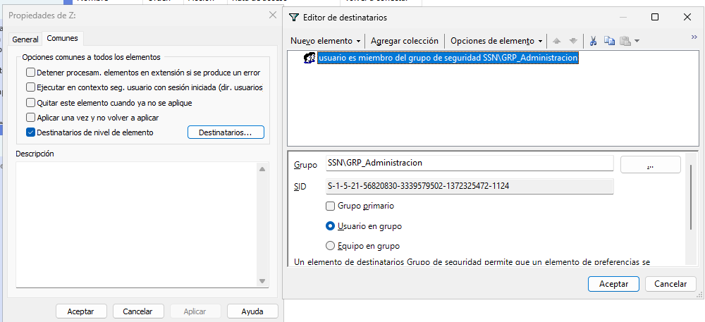
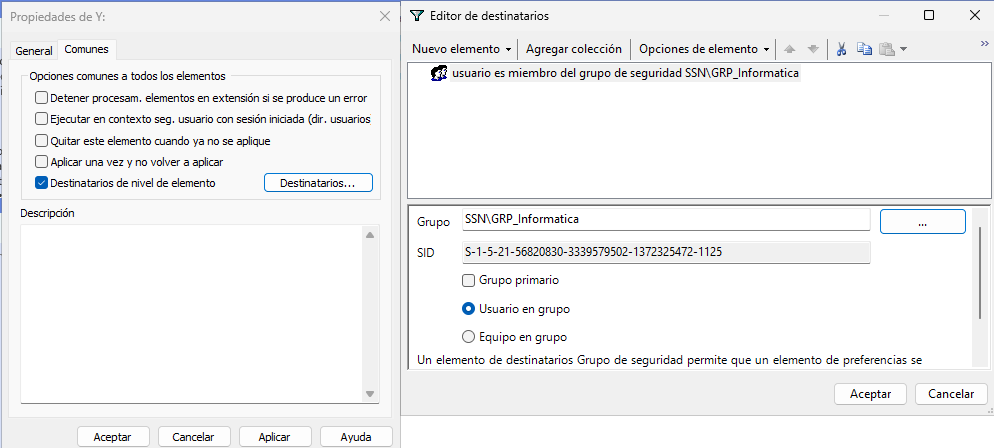

### 4. Verificación en Clientes
Finalmente, se realizaron pruebas de inicio de sesión con diferentes usuarios para validar que el mapeo automático funciona según lo previsto.

### Resultados de Usuario Admin
Al iniciar sesión con user_admin1 (miembro de GRP_Administracion), el explorador de archivos muestra correctamente las unidades Z: (Admin) y X: (Comun).
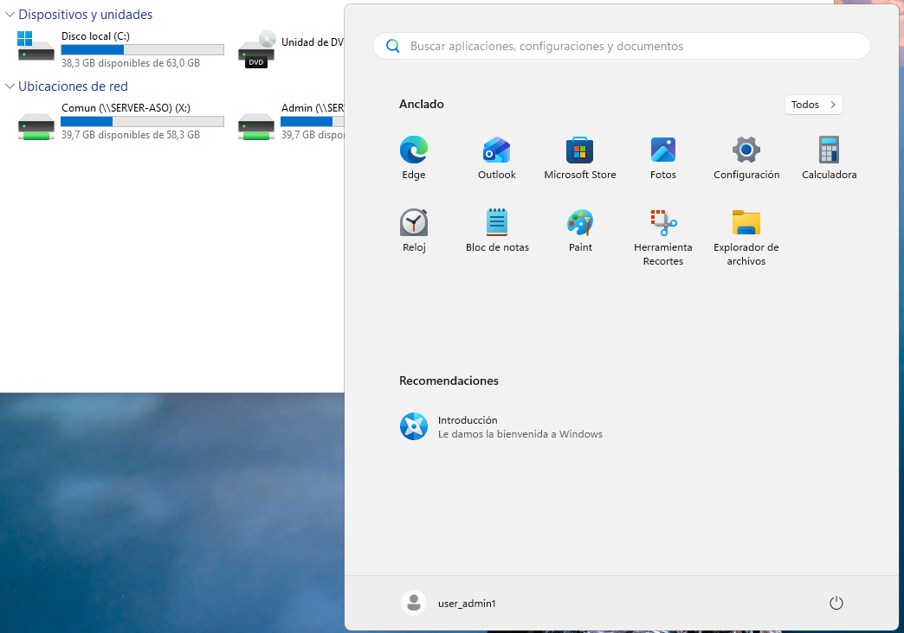

### Resultados de Usuario Informática
Al iniciar sesión con user_info1 (miembro de GRP_Informatica), el sistema mapea automáticamente las unidades Y: (Informatica) y X: (Comun), ocultando la unidad de administración.
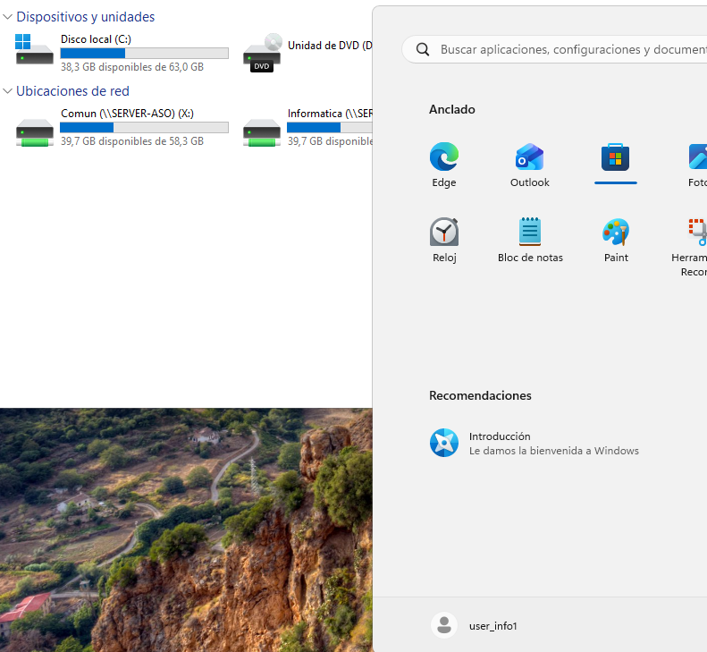

### Resultados a carpeta incorrecta
Al iniciar sesión con user_info1 (miembro de GRP_Informatica), e intentar acceder a la unidad Z: (Admin), no se tiene acceso.
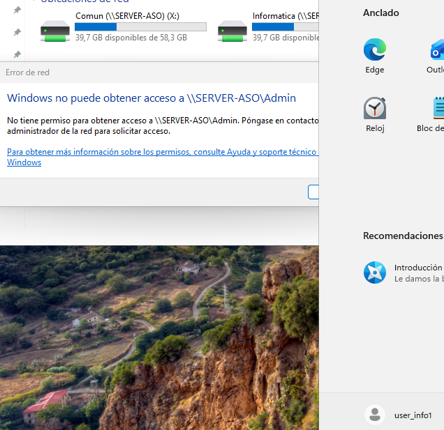

# Parte 2: Script de Limpieza Automático

## 1. Objetivo
Implementar un sistema de mantenimiento automatizado que elimine archivos temporales en los equipos clientes de forma semanal, sin intervención del usuario y generando logs de control.

## 2. Preparación del Script de Limpieza
Se ha desarrollado un script en PowerShell (`limpieza.ps1`) con las siguientes funciones:
* Eliminación de archivos en `%TEMP%`.
* Limpieza de la carpeta temporal del sistema `C:\Windows\Temp`.
* Creación de un log detallado en `C:\Logs\mantenimiento.log`.

### Despliegue en SYSVOL
Para que los clientes puedan acceder al script, se ha copiado a la carpeta compartida del dominio:
`\\ssn.local\SYSVOL\ssn.local\scripts\limpieza.ps1`

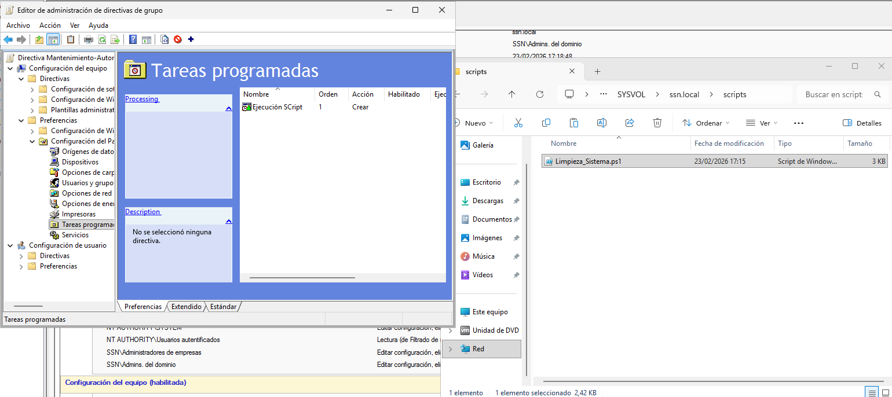

## 3. Configuración de la GPO de Mantenimiento
Se ha creado una nueva GPO denominada **Mantenimiento-Automatico-SSN** vinculada a la **UO_Usuarios**.

### Configuración de la Tarea Programada
Dentro de `Configuración del equipo > Preferencias > Panel de control > Tareas programadas`, se ha configurado una **Tarea programada (Windows 7 o posterior)**:

* **General:** Se ejecuta con la cuenta `NT AUTHORITY\SYSTEM` y con los privilegios más altos.
* **Desencadenadores:** Programada para ejecutarse semanalmente.
* **Acciones:** * **Programa/script:** `limpieza_sistema.ps1`
 * **Argumentos:** `-ExecutionPolicy Bypass -File "\\ssn.local\SYSVOL\ssn.local\scripts\limpieza.ps1"`

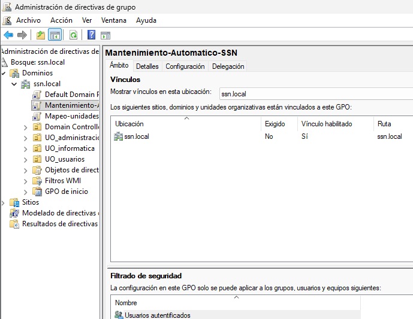
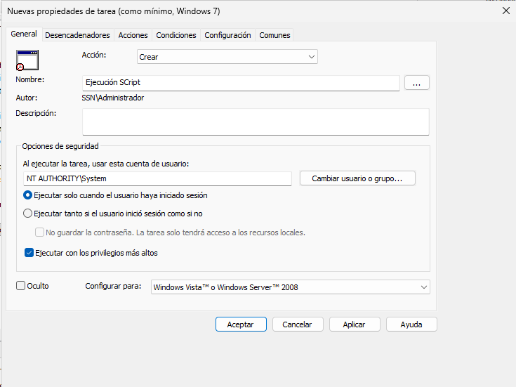
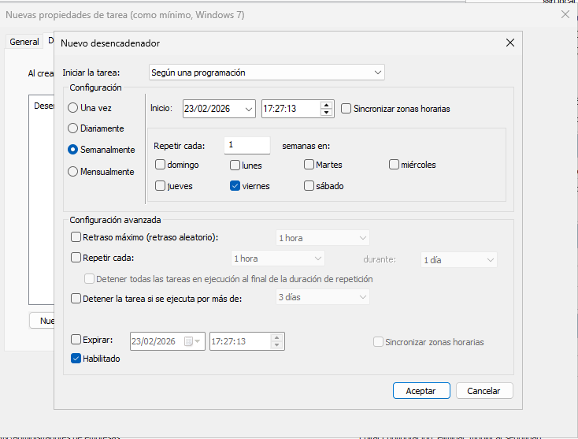
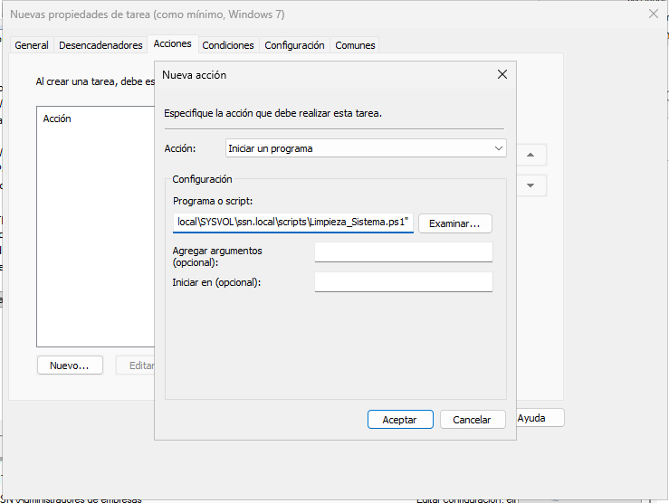

## 4. Verificación en el Cliente
Para comprobar que la automatización es correcta, se realizaron las siguientes pruebas en el equipo Windows 11:

1. **Actualización de políticas:** Se ejecutó `gpupdate /force` en la terminal.
2. **Programador de tareas:** Se verificó que la tarea aparece listada en `taskschd.msc`.
3. **Ejecución manual:** Se forzó la ejecución de la tarea desde el programador.
4. **Validación de Logs:** Se comprobó la existencia del archivo en `C:\Logs\mantenimiento.log` con el resultado del borrado.

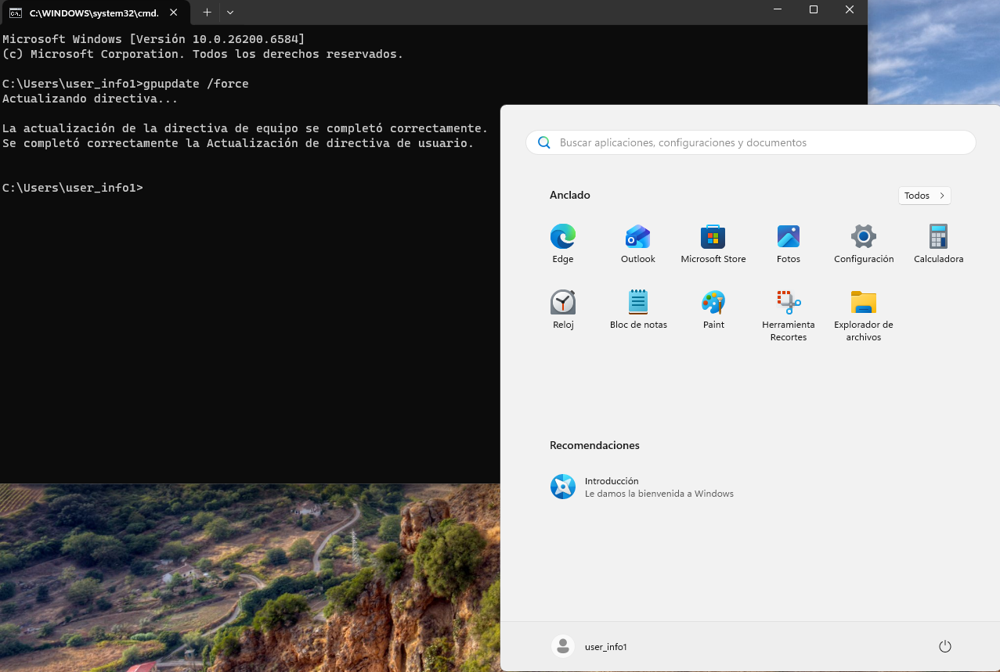
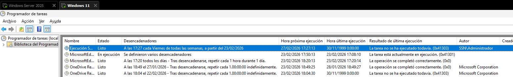
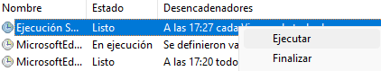
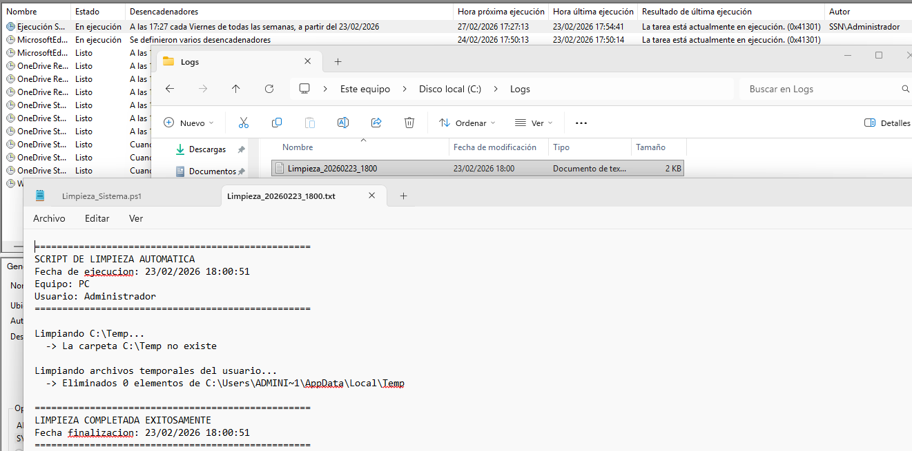